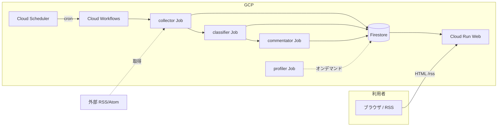

# RSS Aggregator

汎用の **RSS/Atom 集約タイムライン**のテンプレート実装です（GCP: Cloud Run / Firestore / Scheduler / Workflows / Vertex AI）。個人運用の本番サイト用リポジトリとは別管理です。

- **CI/CD**: [`.github/workflows/cd.yml`](.github/workflows/cd.yml) あり。GCP の Secrets・Workload Identity を設定するまでデプロイは失敗します（本番プロジェクトの認証情報を流用しないでください）。
- **feeds**: 同梱の [`feeds.json`](feeds.json) はサンプルのみ。運用時は [`feeds.example.json`](feeds.example.json) をコピーして差し替えてください。

複数の RSS/Atom フィードから **新着を定期収集**し、**ひとつのタイムライン**で一覧します。購読アプリ向けに **集約フィード `/rss`（RSS 2.0）** も配信します（画面には `/rss` への目立ったリンクは置かず、HTML の head に alternate 指定で検出可能。各エントリは元記事へのリンク）。

## アーキテクチャ（概要）



本番のパイプラインやデプロイの詳細は [デプロイ（Terraform / CD）](docs/deploy.md) を参照。**サービス境界・ブログページ・Profiler などの論理設計**は [specs/README.md](specs/README.md)（設計書）を参照。

## 機能

- RSS 収集は **Cloud Run Job**（本番）またはローカルで `services/collector/run.py` を実行。Web から収集 API は公開しない
- 本番では **分類（classifier）・コメント生成（commentator）** も Cloud Run Job。Scheduler → Workflows で収集→分類→コメントの順に実行。定期実行は Terraform 既定で **1 日 3 回**（東京時間 8 / 12 / 20 時）。スケジュール変更は [デプロイ](docs/deploy.md) を参照。
- 記事一覧の新着順表示（htmx）。**初回は先頭 50 件**、「**もっと見る**」で **50 件ずつ最大 200 件**まで拡張（`GET /articles?limit=…` を htmx で差し替え）。一覧は **約 5 分ごと**に自動更新（ポーリング）
- ヘッダー・フッターのナビ（About・ブログ一覧）
- **`GET /rss`**（集約フィード。画面からの目立ったリンクはなし）
- URL をキーにした重複記事の除外
- `feeds.json` はリクエストごとに読み直す（詳細は [feeds と環境変数](docs/env-feeds.md)）
- **Profiler Job**（`services/profiler`）が Firestore **`feeds`** にブログ紹介 **`profile`** を書き込み、Web の **`/blogs/{slug|hex}`** が表示する（[プロファイラ Job](specs/profiler-job.md)）。
- Profiler の **CD** は **イメージと Cloud Run Job 定義の更新まで**（自動では実行しない）。**実行**は GCP コンソール、`.github/workflows/profiler.yml` の **workflow_dispatch**、または CLI（[デプロイ](docs/deploy.md)）。
- 記事ストレージは **Firestore**（ローカル Docker は **`services/web/.env`** でプロジェクト ID を指定し、ホストの ADC で認証）

## クイックスタート

ブラウザは **`http://127.0.0.1:8000`** を開きます。

**Docker（推奨）**

```bash
cd rss-aggregator
cp services/web/.env.example services/web/.env   # GOOGLE_CLOUD_PROJECT を編集
gcloud auth application-default login   # 初回のみ
docker compose up --build
```

**Docker でテスト（pytest）**

```bash
docker compose --profile test run --rm tests
```

ルートの `pytest` 設定どおり **workspace 全体**のテストをまとめて実行します（イメージ初回は `docker compose --profile test build tests` が必要なことがあります）。特定サービスだけに絞る例は [ローカル開発](docs/local.md) を参照。

**uv**

```bash
cd rss-aggregator
uv sync --dev --extra cloud
GOOGLE_CLOUD_PROJECT=your-project-id FEEDS_JSON_PATH=./feeds.json \
  uv run uvicorn web.main:app --reload --app-dir services/web --port 8000
```

初回は `feeds.json` を確認してから Web を起動し、収集を一度走らせます（例: `uv run python services/collector/run.py`）。手順の詳細は [ローカル開発](docs/local.md) を参照してください。

## ドキュメント

**[docs/README.md](docs/README.md)** に一覧があります。よく使うページへのショートカット:

[ローカル開発](docs/local.md) · [feeds と環境変数](docs/env-feeds.md) · [デプロイ（Terraform / CD）](docs/deploy.md) · [トラブルシュート](docs/troubleshooting.md) · [HTTP / API](docs/api.md)
