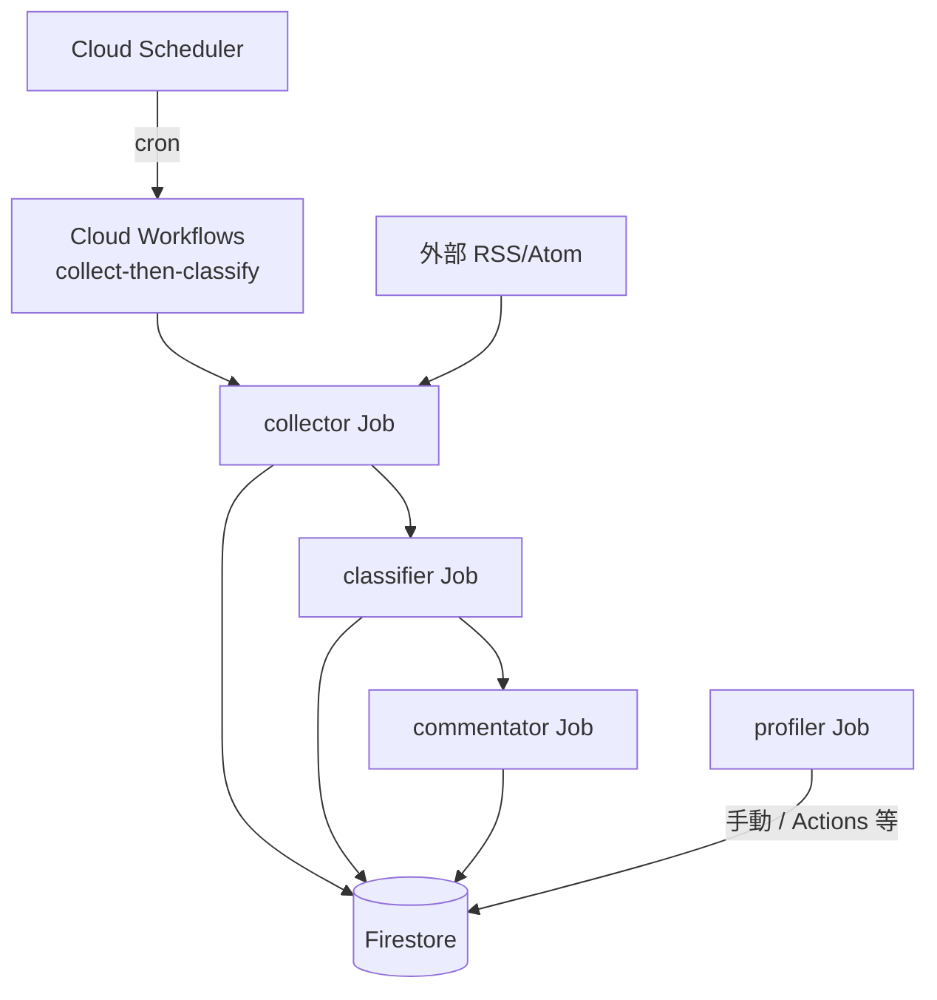
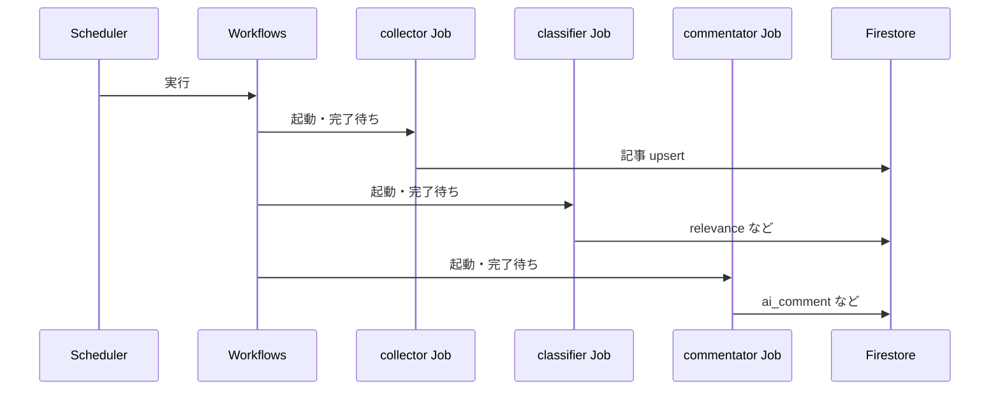

# Cloud Run とデプロイ

Cloud Run では Firestore を利用します。インフラは `infra/` の Terraform で管理します。

コンテナイメージを Artifact Registry などに push したあと、Terraform 変数でそのイメージを指定します。

## GCS に state を置く（推奨）

1. **バケットを作成**（名前は全世界で一意。プロジェクトは自分の GCP）。

リポジトリのスクリプト（`gcloud` が手元で使える場合）:

```bash
chmod +x infra/scripts/create_tf_state_bucket.sh
gcloud config set project YOUR_GCP_PROJECT_ID   # 未設定なら
./infra/scripts/create_tf_state_bucket.sh       # 既定バケット名: ${PROJECT}-rss-aggregator-tfstate
# infra/backend.hcl を自動生成する場合:
WRITE_BACKEND_HCL=1 ./infra/scripts/create_tf_state_bucket.sh
```

手動で `gcloud` だけ使う場合:

```bash
gcloud storage buckets create gs://YOUR_UNIQUE_BUCKET_NAME \
  --project=YOUR_GCP_PROJECT_ID \
  --location=asia-northeast1 \
  --uniform-bucket-level-access

# 続き: state 破損時の復旧のため、オブジェクトバージョニングを有効にする（推奨）
gcloud storage buckets update gs://YOUR_UNIQUE_BUCKET_NAME \
  --project=YOUR_GCP_PROJECT_ID \
  --versioning
```

確認: `gcloud storage buckets describe gs://YOUR_UNIQUE_BUCKET_NAME --format='yaml(versioning)'` に `enabled: true` が出れば有効です。

2. **`infra/backend.hcl`** を用意する（コミットしない）。

```bash
cd infra
cp backend.hcl.example backend.hcl
# backend.hcl を編集し、bucket を上で作ったバケット名にする
```

3. **`terraform.tfvars`** を用意してから init（backend を読み込む）。

```bash
cp terraform.tfvars.example terraform.tfvars
# terraform.tfvars で project_id などを編集

terraform init -backend-config=backend.hcl
terraform plan
terraform apply
```

既にローカルだけの `terraform.tfstate` で運用していた場合は、`terraform init -backend-config=backend.hcl` 実行時に **state の移行**を聞かれるので指示に従う。

`terraform.tfvars` では少なくとも次を設定します。

- `project_id`
- `container_image`（初回 apply 用。空なら Terraform の既定プレースホルダも可）

Terraform は次を作成します（`infra/` 参照）。

- Cloud Run（Web）、Cloud Run Job（収集・採点・コメント・**プロファイル生成 profiler**）、Firestore、Cloud Scheduler、Cloud Workflows、ランタイム用サービスアカウント
- Artifact Registry（Docker）リポジトリ `rss-aggregator`（変数 `artifact_registry_repository_id` で変更可）
- GitHub Actions 用サービスアカウントと **Workload Identity Federation**（リポジトリはデフォルト `kkj333/rss-aggregator`。別名なら `github_repository` を `terraform.tfvars` に書く）

Cloud Scheduler は **Cloud Workflows**（`collect-then-classify`）を起動し、Workflow が **collector 完了 → classifier 完了** を待ってから commentator を実行します。直接 Job を呼び出す構成ではありません。

スケジュールは Terraform の **`scheduler_cron`**（既定: **`Asia/Tokyo` で 8:00・12:00・20:00 の 1 日 3 回**、`0 8,12,20 * * *`）。変更は `terraform.tfvars` で上書きできます。

Cloud Run Job の **1 タスクあたりの実行時間上限**は **`cloud_run_job_task_timeout`**（既定 **`3600s`** = 1 時間）。Cloud Run の既定 600 秒では Gemini 連続呼び出しのバッチが打ち切られることがあります。GitHub Actions の **`CLOUD_RUN_JOB_TASK_TIMEOUT`** と `gcloud run jobs deploy --task-timeout` で Terraform と同じ値を渡しています。調整手順は [`docs/troubleshooting.md`](troubleshooting.md) を参照。

### 構成図（Mermaid）



バッチ内の役割の切り分け（順序・完了待ち）は Workflows 側のオーケストレーションです。**profiler** は Scheduler に載らず、**オンデマンド**で Firestore `feeds` を更新します。



## 監視・メトリクス

### ログの確認（Cloud Logging）

Cloud Console → **Logging → ログ探索** で各 Job のログを確認できます。

**全 Job まとめて見る:**

```
resource.type="cloud_run_job"
resource.labels.job_name=~"rss-aggregator-(collector|classifier|commentator|profiler)"
```

**注目するログ行:**

| Job | ログ | 意味 |
| --- | --- | --- |
| collector | `Articles collected:` | 収集件数（JSON stats） |
| collector | `Clamping absurd RSS published_at` | 異常未来日付を補正した記事あり |
| classifier | `Unclassified articles to score: N` | 採点対象件数 |
| commentator | `Articles to comment: N` | コメント対象件数 |
| commentator | `tokens: prompt=N candidates=N total=N` | 記事ごとのトークン消費 |
| commentator | `{"total":N,"commented":N,"failed":0,"tokens":{...}}` | ジョブ終了時の集計（最終行） |
| profiler | `Profiling complete: total=…`（INFO）と stdout の `{"feeds_total":N,…}` | 正常終了時は両方（`services/profiler/run.py` が同一集計をログと print で出力） |

### commentator トークン消費（Cloud Monitoring）

commentator Job はジョブ終了時に次の JSON を stdout へ出力します。

```json
{"total": 10, "commented": 10, "failed": 0, "tokens": {"prompt": 1200, "candidates": 300, "total": 1500}}
```

この stats 行だけ絞り込むログクエリ:

```
resource.type="cloud_run_job"
resource.labels.job_name="rss-aggregator-commentator"
jsonPayload.tokens.total>=0
```

Terraform（`infra/main.tf`）は `google_logging_metric` リソースで **`logging.googleapis.com/user/commentator/tokens_total`** というログベースメトリクスを管理しています。

**チャートの作り方（Metrics Explorer）:**

1. Console → **Monitoring → Metrics Explorer**
2. 指標の検索欄に `commentator/tokens_total` と入力
3. リソースタイプ: **Global**（ログベースメトリクスはここに出る）
4. グラフ種別は **Heatmap**（バケット分布）や **Percentile** が見やすい
5. 右上「保存」→ ダッシュボードに固定可能

> ジョブを一度も実行していない場合、メトリクスが選択肢に出ないことがあります。ワークフロー実行後、数分待ってから確認してください。

## GitHub Actions（main は stg、tag は prod）

1. 上記のとおり **`terraform apply` を一度実行**し、Artifact Registry と WIF を作る。
2. 初回だけ、手元でイメージをビルドして push するか、空でもよいので Terraform の `container_image` と同じタグを用意する（Cloud Run 作成に必要な場合あり）。
3. GitHub リポジトリの **Settings → Secrets and variables → Actions** で次を設定する。
   - **Secrets**
     - `STG_WIF_PROVIDER` / `PROD_WIF_PROVIDER` … `terraform output -raw github_actions_workload_identity_provider`
     - `STG_WIF_SERVICE_ACCOUNT` / `PROD_WIF_SERVICE_ACCOUNT` … `terraform output -raw github_actions_service_account_email`
   - **Variables**（推奨）または **Secrets** のどちらか一方
     - `STG_GCP_PROJECT_ID` / `PROD_GCP_PROJECT_ID` … 各環境の GCP プロジェクト ID
   - **任意 Variables**
     - `STG_SERVICE_NAME` / `PROD_SERVICE_NAME` … Cloud Run service/job 名を環境で分ける場合に指定（未指定時は既定 `rss-aggregator`）。
     - `STG_TF_STATE_BUCKET` / `PROD_TF_STATE_BUCKET` … CD で Terraform apply を使う場合の環境別 state バケット名。
   - 既存の `GCP_PROJECT_ID` / `WIF_PROVIDER` / `WIF_SERVICE_ACCOUNT` はフォールバックとして残せるが、環境分離運用では `STG_*` / `PROD_*` を推奨。

4. `.github/workflows/cd.yml` は次のトリガーで動く（JSON キーは不要）。
   - `main` push: **staging** 向けに Web／collector／classifier／commentator／**profiler** の build・push と **`gcloud run jobs deploy`**（イメージ・ジョブ定義の更新）を実行
   - `v*.*.*` tag push: **production** 向けに同じ deploy を実行
   それぞれ `STG_*` / `PROD_*` の Variables/Secrets（`*_GCP_PROJECT_ID`, `*_WIF_PROVIDER`, `*_WIF_SERVICE_ACCOUNT`）を使い分ける。

**profiler の実行:** CD は Job を **デプロイするだけ**で、**`gcloud run jobs execute` は走りません**。実行は Cloud Console の「実行」、または `.github/workflows/profiler.yml` の **workflow_dispatch**（任意）、あるいは CLI で行います。`PROFILER_SKIP_EXISTING=true`（CD の既定）のとき、既に `profile` があるフィードは LLM を呼ばずスキップします。

収集・採点・コメント生成・プロファイル生成の各 Job は **`gcloud run jobs deploy`** のため、未定義なら **作成**されます（Terraform の Job と同じサービスアカウント・環境変数を指定）。それでも失敗する場合は、**一度 Terraform で API 有効化・Firestore・ランタイム SA（`${service_name}-run@...`）・Scheduler 用 IAM** などを用意したうえで再試行してください。

commentator Job の切り分けでは、次を先に確認してください。

- 実行 revision のコンテナ image が `services/commentator` の Artifact Registry イメージになっていること（初期プレースホルダ image のままだと Task は成功してもアプリログは出ない）。
- 実行ログに `Articles to comment:` が出ていること（この行がない場合、アプリ本体が起動していない可能性が高い）。

## CD に Terraform を載せる（任意）

毎回の `terraform apply` を GitHub Actions に任せられますが、次が前提です。

1. **State 用 GCS バケット**を手動で作成する（Terraform が自分で作れない「最初のバケット」問題のため）。
2. Repository **Variables** に `STG_TF_STATE_BUCKET` / `PROD_TF_STATE_BUCKET`（環境別バケット名）を設定し、`TF_APPLY_IN_CD` を **`true`** にする（未設定・false のとき CD は従来どおり Terraform を実行しない）。既存 `TF_STATE_BUCKET` はフォールバックとして利用可能。
3. Workload Identity の **GitHub Actions 用 SA** に、`infra/github_actions_wif.tf` で定義しているロールを付与する（`roles/editor` は使わず、API 有効化・SA 管理・Artifact Registry・Firestore（datastore.owner）・Scheduler・Storage・Project IAM・Run・WIF に分割）。初回の鶏卵は **`infra/scripts/bootstrap_gcp_for_ci.sh`** をオーナーが一度実行。**既に `roles/editor` だけ付いている状態から移行する**ときは、先に同スクリプトで新ロールを足してから `terraform apply` し、途中で権限が途切れないようにする。

4. **State 用 GCS バケット**に、同じ GitHub Actions 用 SA へ **`roles/storage.objectAdmin`** が必要（`terraform init` が `storage.objects.list` 等を使う）。`terraform.tfvars` に `terraform_state_bucket = "（STG_TF_STATE_BUCKET / PROD_TF_STATE_BUCKET と一致するバケット名）"` を書くと、Terraform でその IAM を管理できる。初回は **state にまだ当該 binding が無い**と、CD の `terraform init` だけ 403 になる。次の **一度きり**の付与で通る（`SERVICE` は通常 `rss-aggregator`、SA は `terraform output` でも確認可）:

```bash
gcloud storage buckets add-iam-policy-binding "gs://YOUR_STATE_BUCKET" \
  --project="YOUR_GCP_PROJECT_ID" \
  --member="serviceAccount:YOUR_SERVICE-gha@YOUR_GCP_PROJECT_ID.iam.gserviceaccount.com" \
  --role="roles/storage.objectAdmin"
```

`infra/backend.tf` は **GCS backend** 前提です。ローカルでは上記の **`backend.hcl`** で `terraform init -backend-config=backend.hcl` を使うのがおすすめです（stg/prod それぞれで CI の `STG_TF_STATE_BUCKET` / `PROD_TF_STATE_BUCKET` と **同じバケット名**にすると state が共有されます）。

**注意:** `TF_APPLY_IN_CD=true` の場合、`main` push で **staging 側**の `apply` が走ります。production 反映は `v*.*.*` tag push で行う運用を推奨します。

**Terraform と CD のイメージ:** 初回 `apply` では `container_image` でサービスを作成します。以降のタグ更新は **cd.yml が担当**し、Terraform は `lifecycle.ignore_changes` でコンテナ **image** を触りません。インフラ（環境変数・IAM 等）を変えたいときだけ `terraform apply` すれば、実行中のイメージは上書きされません。イメージを Terraform 側に戻したい場合は一時的に `ignore_changes` を外すか、`gcloud run services update` で意図したタグに合わせてから state に揃えます。
