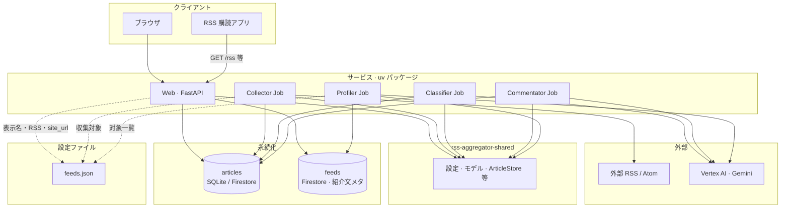
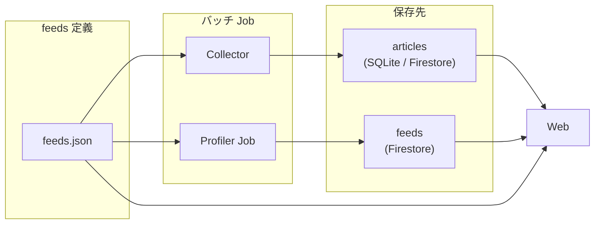

# 設計書（specs）

実装の意図・データモデル・境界をまとめる。**運用手順やコマンド**は `docs/`（[ドキュメント一覧](../docs/README.md)）を正とする。

## 位置づけ

このディレクトリは **設計の共有用**です。実装とずれた記述は追随して直してください。

各 spec には主要フローの **Mermaid シーケンス図** を置いている（GitHub / VS Code のプレビューで表示可能）。あわせて **個別アーキテクチャ図**（どのストア／外部を読む／書くか）を載せている。

**実装ベース**（リポジトリにパッケージあり）: [collector-job.md](collector-job.md)、[classifier-job.md](classifier-job.md)、[commentator-job.md](commentator-job.md)、[profiler-job.md](profiler-job.md)、[web-service.md](web-service.md)、[blog-pages.md](blog-pages.md)。

**シーケンス図**は処理の順序、**アーキテクチャ図**はコンポーネント境界と依存関係を説明するのに向く。リポジトリ直下 [README のアーキテクチャ](../README.md#アーキテクチャ概要) は **GCP 上のデプロイ形**を示し、下の **論理アーキテクチャ** は **Python サービスとデータ**にフォーカスする。

### 論理アーキテクチャ（サービス境界）

- **Vertex AI** を使うのは Classifier / Commentator / Profiler（Collector は HTTP でフィード取得のみ）。
- **Profiler** だけが **`feeds` コレクション**へ書く。Web は **`feeds.json` を正**としてタイトルやリンクを描画する（[blog-pages.md](blog-pages.md)）。

### 俯瞰（データの流れ）

Web は **記事** を `articles` から、**ブログ紹介（`profile`）** を **`feeds`** から読み、**掲載ブログ名・RSS・site_url** は実行時の **feeds.json** を正とする。

| 文書 | 内容 |
| --- | --- |
| [Collector Job](collector-job.md) | RSS 収集、`RSSCollector`、`upsert_many`、stdout 統計 |
| [Classifier Job](classifier-job.md) | 未採点記事の関連度スコア（Firestore 必須） |
| [Commentator Job](commentator-job.md) | 閾値以上記事への AI コメント、任意で本文取得 |
| [Web サービス](web-service.md) | FastAPI（`routes` / `core` / `blog` / `syndication`）、ルート一覧、`ArticleStore`、`feeds.json` の参照 |
| [ブログ一覧・個別ページ](blog-pages.md) | `/blogs` と個別ページ（slug または hex）、`profile` の表示 |
| [プロファイラ Job](profiler-job.md) | `services/profiler`、`feeds` に `profile` 等を書き込み |
