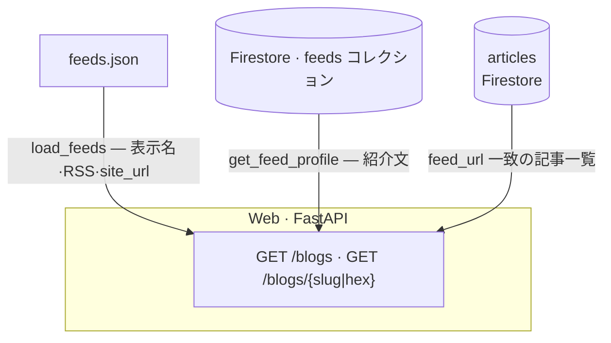
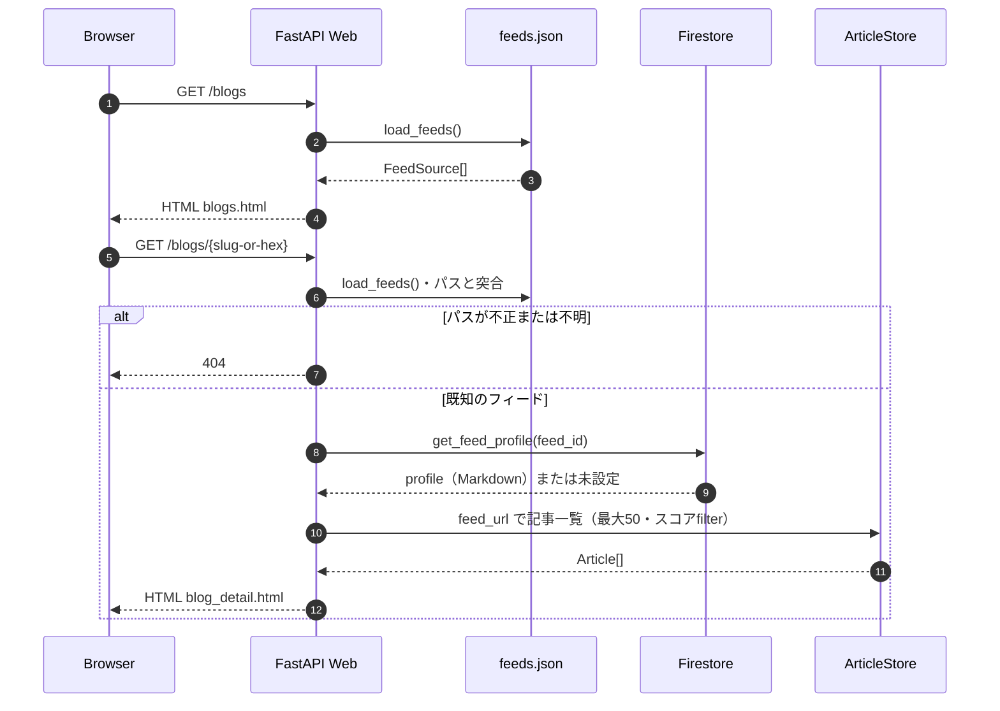

# ブログ一覧・個別ページ

設計書（実装済み）。

## 目的

登録 RSS（`feeds.json`）ごとに **紹介文（AI 生成・Firestore）** と **当該ソースの収集記事** をまとめて見せる。

## アーキテクチャ（本ページ群の参照先）

`/blogs` 系は **3 系統のデータ**を束ねる。全体図は [specs/README.md](README.md) も参照。

- **feeds.json** … 常に最新の掲載定義（プロセス内で毎リクエスト読み直し可）。
- **feeds** … Profiler が書く紹介文。GCP 未設定のローカルでは届かず、紹介文は空扱い。
- **articles** … Collector が蓄積した記事。Web は `FeedSource.url` と `Article.feed_url` の一致で紐づける。

## URL

| パス | 役割 |
| --- | --- |
| `GET /blogs` | 登録ブログ一覧。個別ページへのリンク・ホームページ・RSS（紹介文は個別ページのみ） |
| `GET /blogs/{path}` | ブログ個別ページ（`slug` または legacy の hex） |

## 個別ページのパス（`slug` と feed_id）

- **`slug`（任意）**: `feeds.json` の **`slug`** を指定すると **`/blogs/{slug}`** が canonical。形式は小文字英数字とハイフン（先頭は英字）。**64 文字の hex 文字列は legacy の feed_id 用に予約**し、`slug` には使えない。
- **legacy `feed_id`**: `slug` 未設定時は **`feed_url` の SHA-256 hex 64 文字**で `/blogs/{feed_id}`（Web・Profiler・Firestore `feeds` のドキュメント ID で同一アルゴリズム）。
- **`slug` があるフィード**へ **hex の URL** でアクセスした場合は **301 で `/blogs/{slug}`** にリダイレクトする。
- **整合**: `load_feeds()` に存在しないパスは **404**。

実装: `blog_path_segment`・`resolve_blog_feed`・`compute_feed_id`（`services/web/web/blog/paths.py`）。

### シーケンス（ページ生成）

ブラウザからのリクエストに対し、**ブログ名・リンクは常に `load_feeds()`（feeds.json）**、**紹介文は Firestore `feeds`**（プロジェクト未設定時は取得できず未表示扱い）、**記事一覧は ArticleStore** を参照する。

ローカルで `GOOGLE_CLOUD_PROJECT` を設定しない場合、`get_feed_profile` は紹介文なしとして扱い、記事一覧は `InMemoryArticleStore`（空）になる。

## データソース

### ブログメタ（名前・RSS URL）

- 常に実行時の **`load_feeds()`**（`feeds.json` + `FEEDS_JSON_PATH`）を正とする。
- Firestore の `feeds` ドキュメントの `title` / `feed_url` は Profiler が書くが、**画面の掲載元名・リンクは feeds.json 優先**（個別ページの見出し・**ホームページ**・RSS リンクは `FeedSource`。任意フィールド **`site_url`** がユーザー向けトップ URL）。

### 紹介文（Profiler のプロフィール）

- Firestore **`feeds`** コレクション（名前は `FIRESTORE_FEEDS_COLLECTION`、既定 `feeds`）のドキュメント `document(feed_id)`。
- フィールド **`profile`**（文字列・Markdown）。Profiler Job が Web 検索ベースで生成する。無い場合は「紹介文はまだありません」を表示。
- `GOOGLE_CLOUD_PROJECT` 未設定（例: ローカル SQLite のみ）では Firestore に届かず、紹介文は常に未設定扱い。

実装: `get_feed_profile(feed_id)`（`services/web/web/blog/intro.py`）。

### 記事一覧（最大 50 件・新着順）

- `ArticleStore.list_by_feed(feed_url, limit=50)` で取得する（`FirestoreArticleStore` 実装済み）。
- Firestore クエリ: `articles` コレクションで `feed_url ==` + `published_at` 降順。

**インデックス**: `feed_url` 等価 + `published_at` 降順の **複合インデックス**が必要（`infra/main.tf` の `google_firestore_index.articles_by_feed_url` で管理）。

## テンプレート・ナビ

- `blogs.html` … 一覧（個別ページへの **`hn-feed-name`** は **`/blogs/...` を別タブ**）
- `blog_detail.html` … 個別（記事リストは `_article_macros.html` の `article_row` を再利用）
- `_article_macros.html` … 記事タイトルは **元記事**へ別タブ、掲載元名は **`blog_path_for_feed_url`** で **`/blogs/{slug|hex}`** へ別タブ（グローバル登録は `services/web/web/main.py`、関数本体は `blog/paths.py`）
- ヘッダ・フッターナビに「ブログ」（`/blogs` へのリンク）
- `sitemap.xml` に `/blogs` と各 **`/blogs/{slug|hex}`** を含める（`routes/discovery.py` + `syndication/builders.py`）

ブラウザ向けリンクの整理は [HTTP（HTML / JSON）](../docs/api.md) のブラウザ節も参照。

## 非スコープ

- `feeds.json` の同期を Firestore `feeds` に自動ミラーする処理はない（紹介文・Profiler 用メタのみ `feeds` に書く）。
