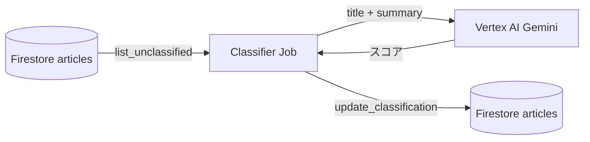
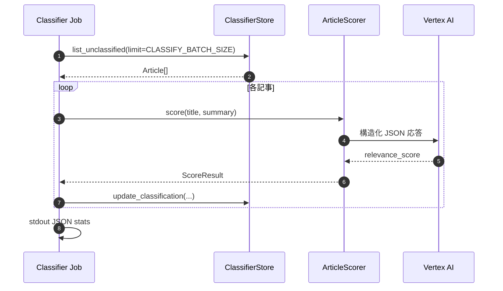

# Classifier Job（`services/classifier`）

## 目的

Firestore に保存された記事のうち **まだ採点されていないもの**を Vertex AI（Gemini）で **関連度スコア（0.0〜1.0）** 付けし、同一ドキュメントに **`relevance_score`** 等を書き戻す。トップ画面などで **低スコア記事を非表示**にするための前処理。

## アーキテクチャ（境界）

**Firestore のみ**（`create_classifier_store`）。ローカル SQLite だけの環境では **動かない**（`GOOGLE_CLOUD_PROJECT` 必須）。

## シーケンス（1 記事）

## 出力（stdout）

`total`, `scored`, `failed`（`services/classifier/run.py`）。

## 環境変数（主要）

| 変数 | 必須 | 備考 |
| --- | --- | --- |
| `GOOGLE_CLOUD_PROJECT` | はい | 未設定時はジョブが終了コード 1 |
| `GEMINI_LOCATION` | いいえ | 既定 `global` |
| `GEMINI_MODEL` | いいえ | 採点に使用 |
| `CLASSIFY_BATCH_SIZE` | いいえ | 1 回の最大件数 |
| `FIRESTORE_COLLECTION` | いいえ | 記事コレクション |

## 実装参照

- `services/classifier/run.py`
- `services/classifier/classify/scorer.py` … `ArticleScorer`
- Firestore 側の「未採点」判定・更新は `shared.storage` の classifier 用ストア
