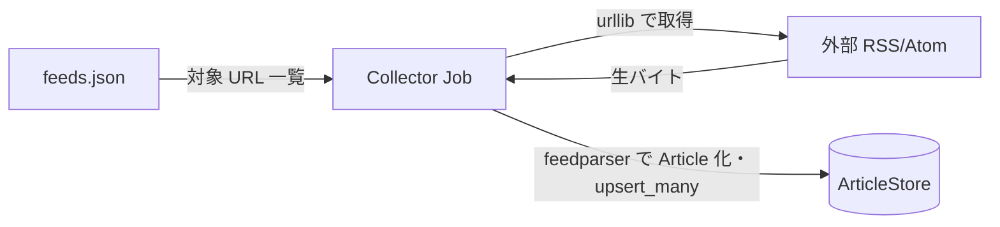
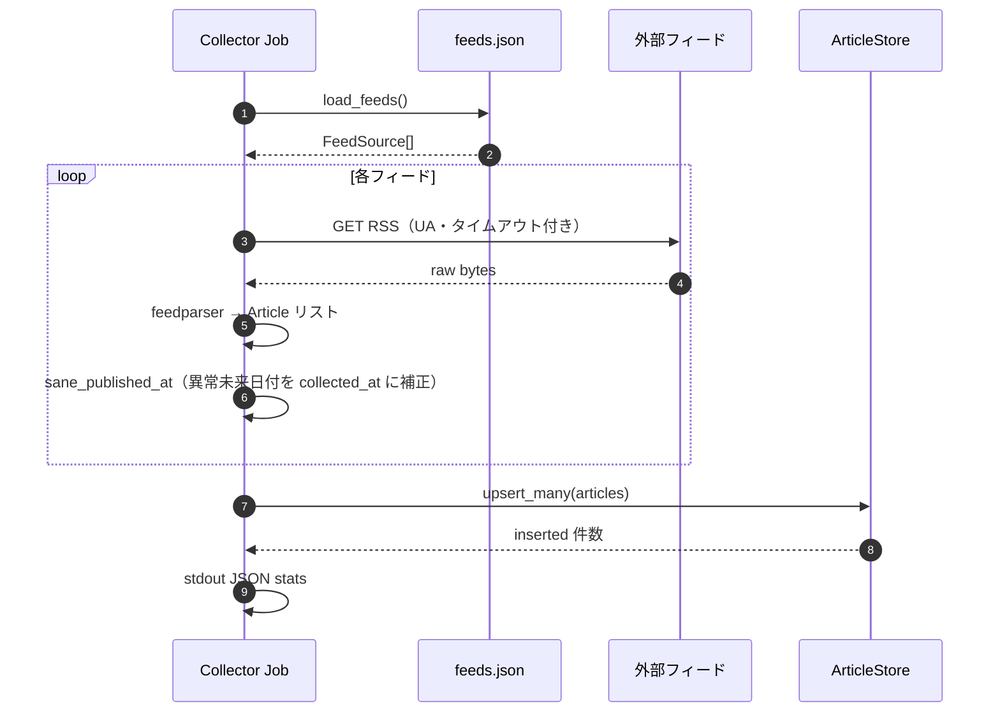

# Collector Job（`services/collector`）

## 目的

`feeds.json` に列挙された **各 RSS / Atom（RDF 含む）を HTTP で取得**し、エントリを **`Article` に正規化してストアへ upsert** する。Cloud Run Job またはローカルで `services/collector/run.py` を実行する。

## アーキテクチャ（境界）

**読み**: `feeds.json`（`load_feeds()`）、**外部**フィード URL。**書き**: **`ArticleStore` のみ**（SQLite または Firestore）。LLM は使わない。

## シーケンス（全体）

個別フィードで取得失敗・解析失敗しても **ジョブ全体は継続**し、`feed_details` にエラーを記録する。

## 出力（stdout）

JSON 一例の構造: `feeds`, `parsed`, `inserted`, `duplicates`, `feed_details`（`services/collector/collect/rss.py` の `CollectStats`）。

## 環境変数（主要）

| 変数 | 役割 |
| --- | --- |
| `FEEDS_JSON_PATH` | 既定はリポジトリ直下 `feeds.json` |
| `GOOGLE_CLOUD_PROJECT` | **必須**。Firestore の GCP プロジェクト |
| `FIRESTORE_COLLECTION` | 記事コレクション名（既定 `articles`） |

## 実装参照

- `services/collector/run.py` … エントリ
- `services/collector/collect/rss.py` … `RSSCollector`, `_download_feed`, `articles_from_feed_xml`
- `services/shared/shared/published_at.py` … `sane_published_at`（異常未来日付の正規化）

## 非スコープ

- 分類・コメント生成（別 Job）。
- Web から収集を叩く HTTP API は公開しない。
