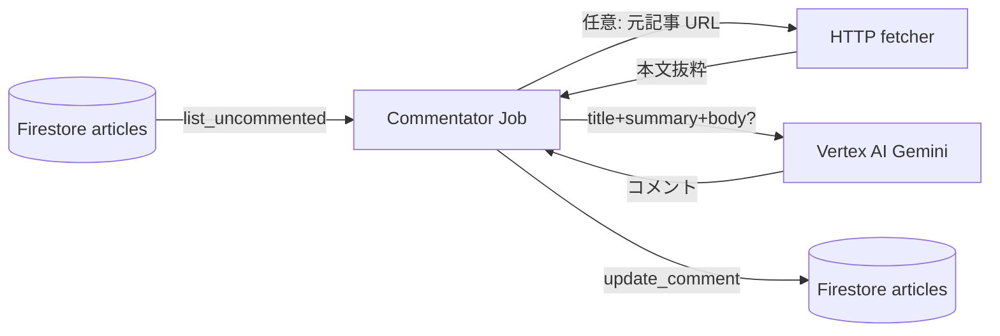
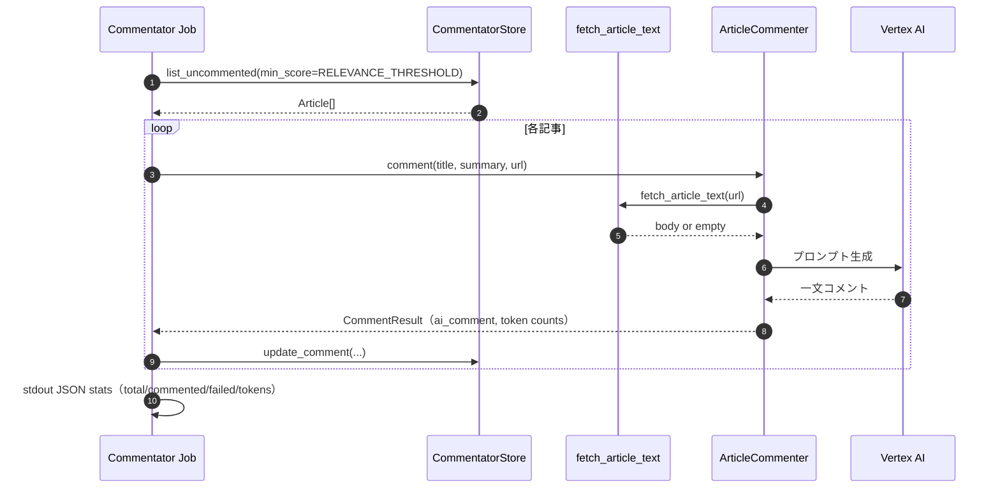

# Commentator Job（`services/commentator`）

## 目的

Firestore の記事のうち、**関連度が閾値以上**かつ **まだ AI コメントが無い**ものに対し、Vertex AI（Gemini）で **短い一言コメント**を生成し、`ai_comment` 等を書き戻す。

## アーキテクチャ（境界）

Classifier と同様 **Firestore 必須**。記事 URL を渡せば **`comment.fetcher`** が robots 確認のうえ HTML を取得し、本文テキストをプロンプトに足す（取得失敗時は要約のみ）。

## シーケンス（1 記事）

## 環境変数（主要）

| 変数 | 必須 | 備考 |
| --- | --- | --- |
| `GOOGLE_CLOUD_PROJECT` | はい | |
| `RELEVANCE_THRESHOLD` | いいえ | コメント対象の下限スコア |
| `COMMENTATOR_MODEL` | いいえ | |
| `COMMENT_BATCH_SIZE` | いいえ | 1 回の最大件数 |
| `GEMINI_LOCATION` | いいえ | Vertex リージョン |

`GOOGLE_GENAI_USE_VERTEXAI` は run.py で既定セットされる。

## 実装参照

- `services/commentator/run.py`
- `services/commentator/comment/commenter.py`
- `services/commentator/comment/fetcher.py`
