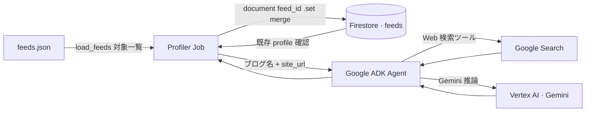
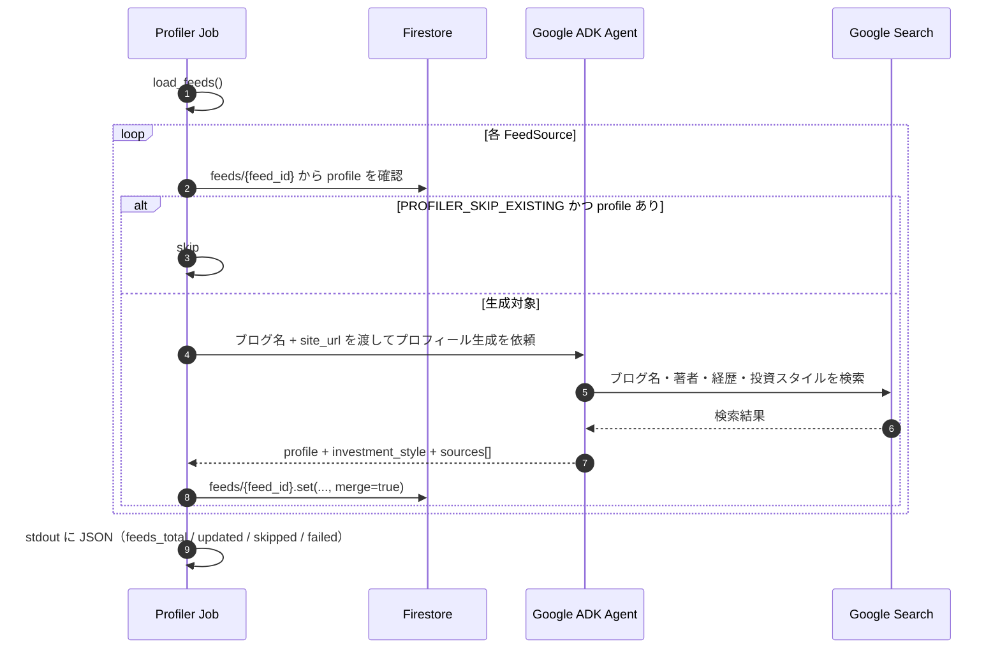

# プロファイラ Job（`services/profiler`）

設計書（実装は `services/profiler`）。

## 目的

各登録 RSS について、**ブログ URL を起点に Web 検索で情報を収集し、詳細プロフィール・投資スタイル分類・参照 URL を生成**して Firestore の **`feeds` コレクション**に保存する。Web の `/blogs/{slug|hex}` が **`profile`** フィールドとして表示する。

## アーキテクチャ（Profiler の境界）

バッチ専用。**読み**は `feeds.json`・**`feeds` コレクション**、**書き**は **`feeds` コレクション** と **Google ADK エージェント呼び出し**のみ。



## 実行形態

- **Cloud Run Job**（HTTP サーバではない）。エントリ: `services/profiler/run.py`。
- コンテナ: `services/profiler/Dockerfile`。

## CD と実行トリガー

- **Terraform**（`infra/main.tf`）で Profiler 用 Cloud Run Job が定義される。
- **GitHub Actions `cd.yml`** は main / バージョンタグのたびに profiler イメージをビルドし **`gcloud run jobs deploy`** で Job 定義を更新する。**ジョブの実行（`execute`）は CD に含めない**運用が既定（デプロイだけでは Firestore は更新されない）。
- 実行は **GCP コンソールからの手動実行**、または **`.github/workflows/profiler.yml` の workflow_dispatch** でよい。

## シーケンス（1 ソースあたりの概略）



## Firestore `feeds` コレクション

### 書き込むフィールド

| フィールド | 型・意味 |
| --- | --- |
| `title` | ブログ表示名（`feeds.json` の title） |
| `feed_url` | RSS URL |
| `site_url` | ブログのトップ URL（`feeds.json` の site_url） |
| `profile` | AI 生成の詳細プロフィール（Markdown 形式）。経歴・投資スタイル・著書・SNS など |
| `investment_style` | コンテンツカテゴリ（配列）。下記の選択肢から1つ以上 |
| `sources` | 参照 URL 一覧（Web 検索結果から抽出） |
| `profiled_at` | 生成時刻（UTC） |
| `profiler_version` | 使用モデル名 |

### investment_style の選択肢

| 値 | 意味 |
| --- | --- |
| `テック` | 技術・開発 |
| `ビジネス` | ビジネス・キャリア |
| `ライフスタイル` | 生活・趣味全般 |
| `ニュース` | 時事・ニュース |
| `趣味` | 特定の趣味・サブカルチャー |
| `その他` | 上記に当てはまらない場合 |

複数該当する場合は配列で保存（例: `["テック", "ビジネス"]`）。

### profile の出力イメージ

```markdown
サンプルテックブログは、ソフトウェア開発とクラウド運用を中心に発信する個人ブログです。

**プロフィール**
運営者はインフラエンジニア。週1〜2回のペースで技術記事を公開しています。

**主なテーマ**
GCP、Terraform、Python、CI/CD など。

**関連リンク**
GitHub と X アカウントへのリンクあり。
```

## Google ADK

- **フレームワーク**: `google-adk`
- **モデル**: `PROFILER_MODEL`、未設定時 `gemini-3-flash-preview`
- **ツール**: `google_search`（ADK 組み込みの Web 検索ツール）
- **セッション**: `InMemorySessionService`。`create_session()` は ADK 1.0 以降 **非同期**のため、実装では `asyncio.run(...)` でセッションを取得する。
- **実装**: `services/profiler/feed_profiler/style_profiler.py`
- **出力**: `LlmAgent(..., output_schema=ProfileResult)` による構造化 JSON（`generate_content_config.response_schema` には載せない）

### プロンプト方針

```
以下のブログについて Web 検索で情報を収集し、JSON 形式で返してください。

ブログ名: {title}
URL: {site_url}

Pydantic モデル `ProfileResult` で返す:
{{
  "profile": "Markdown形式の詳細プロフィール（運営者概要・主なテーマ・関連リンクなど）",
  "investment_style": ["テック", "ビジネス"],
  "sources": ["https://..."]
}}

profile に含める項目（情報が取得できたものだけ）:
- 運営者・サイトの概要
- 主なテーマ・カテゴリ
- 更新頻度や特徴
- 関連リンク・SNS

investment_style の選択肢:
テック / ビジネス / ライフスタイル / ニュース / 趣味 / その他

ルール:
- 日本語で回答する
- 断定的な助言・勧誘は含めない
- JSON のみ返す（前置き・説明文は不要）
```

## ふるまい・スキップ条件

- **`PROFILER_SKIP_EXISTING`**: 既定 `true`。`profile` が非空ならスキップ（再生成しない）。
- ADK 失敗・検索失敗・JSON パース失敗: `failed` カウント、ログに例外。

## コスト

- Google Search ツール呼び出しは検索クエリ単位で課金。
- `PROFILER_SKIP_EXISTING=true` により初回のみ生成するためコストは抑えられる。
- 登録フィードが数十件程度なら初回の費用は軽微。

## 環境変数

| 変数 | 必須 | 既定・備考 |
| --- | --- | --- |
| `GOOGLE_CLOUD_PROJECT` | はい | Firestore / Vertex |
| `FIRESTORE_FEEDS_COLLECTION` | いいえ | `feeds` |
| `GEMINI_LOCATION` | いいえ | `global` |
| `PROFILER_MODEL` | いいえ | `gemini-3-flash-preview` |
| `PROFILER_SKIP_EXISTING` | いいえ | `true` |
| `FEEDS_JSON_PATH` | いいえ | コンテナ同梱 `feeds.json` |
| `PROFILER_DEBUG` | いいえ | デバッグ時に `true` 等（ログが DEBUG になる） |

## 依存パッケージ

- `rss-aggregator-shared`（`get_settings`, `load_feeds`）
- `rss-aggregator-shared[cloud]`
- `google-adk>=1.32.0`（`services/profiler/pyproject.toml` が正）

## Pydantic モデル

```python
from pydantic import BaseModel

class ProfileResult(BaseModel):
    profile: str
    """Markdown形式の詳細プロフィール（運営者概要・主なテーマ・関連リンクなど）"""
    investment_style: list[str]
    """コンテンツカテゴリ。選択肢: テック / ビジネス / ライフスタイル / ニュース / 趣味 / その他"""
    sources: list[str]
    """参照 URL 一覧（Web 検索結果から抽出）"""
```

実装では **`LlmAgent`** に **`output_schema=ProfileResult`** を渡す。最終イベントのテキストを **`ProfileResult.model_validate_json`** で検証する。

## Pydantic 構造化出力の取り込み（実装メモ）

ADK の **`LlmAgent`** で **`output_schema=ProfileResult`** を指定する（スキーマを `generate_content_config.response_schema` に載せる形式はバリデーションエラーになるため使わない）。

Runner の同期 **`run(...)`** でイベントをたどり、最終応答のテキストを **`ProfileResult.model_validate_json(...)`** に渡す。パース失敗時は `failed` カウントしてログに残す。

## Pydantic Field を使ったモデル定義

`Field` を使うとフィールドの説明・デフォルト値・バリデーションを明示できる。LLM への説明としても機能するため、構造化出力の精度が上がる。

```python
from pydantic import BaseModel, Field

class ProfileResult(BaseModel):
    profile: str = Field(
        description="Markdown形式の詳細プロフィール。運営者概要・主なテーマ・関連リンクなどを含む。"
    )
    investment_style: list[str] = Field(
        description="コンテンツカテゴリ。テック / ビジネス / ライフスタイル / ニュース / 趣味 / その他 から該当するものを選択。複数可。"
    )
    sources: list[str] = Field(
        default_factory=list,
        description="参照した URL の一覧。Web 検索結果から抽出。"
    )
```

`Field(description=...)` の内容は LLM へのヒントになるので、選択肢や形式を具体的に書くと出力精度が上がる。