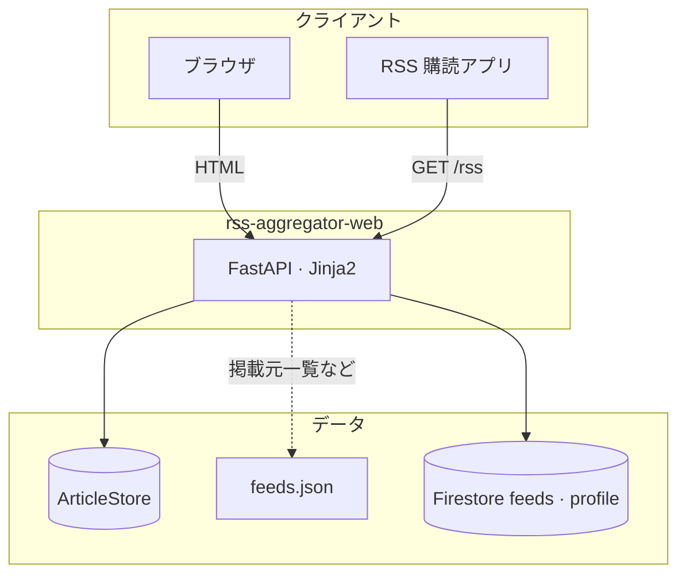
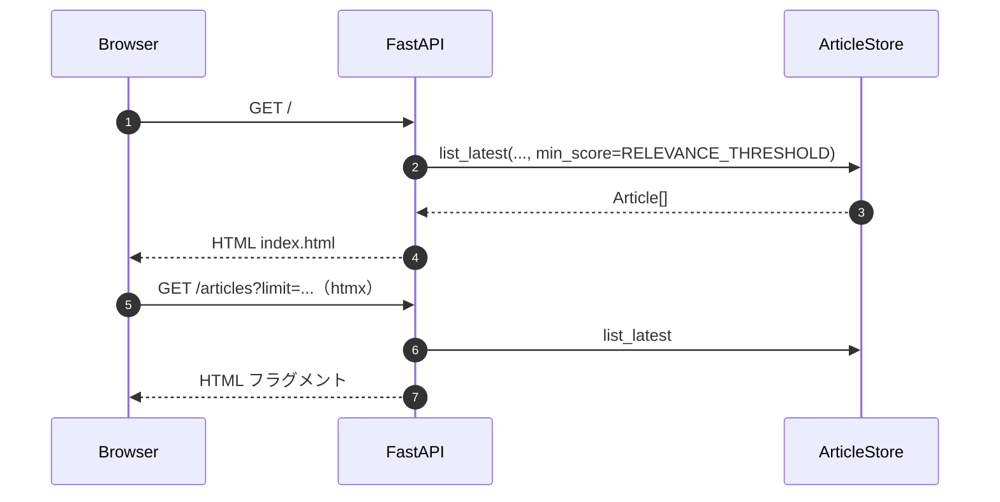

# Web サービス（`services/web`）

## 目的

**FastAPI** で HTML・集約 RSS・JSON API・運用用ヘルスを提供する。記事データは **`ArticleStore`**（Firestore）から読み、`feeds.json` は **`load_feeds()`** でブログ一覧などに利用する。

## アーキテクチャ（境界）

## 主なルート

| メソッド | パス | 説明 |
| --- | --- | --- |
| GET | `/` | トップ（新着記事・htmx「もっと見る」） |
| GET | `/articles` | 記事一覧フラグメント（`X-Robots-Tag: noindex`） |
| GET | `/blogs` | ブログ一覧（ページネーション） |
| GET | `/blogs/{slug-or-feed-id}` | ブログ個別ページ（紹介文＋記事一覧）。紹介文は Firestore **`feeds`** の **`profile`**（`get_feed_profile`）。`feeds.json` に `slug` があればそのパス、なければ 64 桁 hex の feed id |
| GET | `/feeds` | `/blogs` への 301 リダイレクト |
| GET | `/about` | About |
| GET | `/rss` | 集約 RSS 2.0 |
| GET | `/api/feeds` | 登録ソース JSON |
| GET | `/api/articles` | 記事 JSON |
| GET | `/robots.txt` | |
| GET | `/sitemap.xml` | |
| GET | `/healthz` | `{"status":"ok"}` |
| GET | `/static/...` | CSS 等 |

詳細は [HTTP（HTML / JSON）](../docs/api.md)。HTML の **別タブリンク**（記事・掲載元・ブログ一覧など）は同ページのブラウザ節を参照。

## シーケンス（トップページ）

## 環境変数（主要）

Web も **`shared.config.Settings`** を共有する。代表例:

| 変数 | 役割 |
| --- | --- |
| `APP_NAME` | サイト名 |
| `PUBLIC_BASE_URL` | canonical・RSS・sitemap の絶対 URL |
| `GOOGLE_CLOUD_PROJECT` / `FIRESTORE_COLLECTION` | 記事ストア（Firestore のみ。未設定時は `InMemoryArticleStore` で起動） |
| `FIRESTORE_FEEDS_COLLECTION` | ブログ紹介文を読む **`feeds`** コレクション名（既定 `feeds`。Profiler の書き込み先と揃える） |
| `FEEDS_JSON_PATH` | `feeds.json` |
| `RELEVANCE_THRESHOLD` | トップ・`/articles`・`/rss` で `relevance_score >= しきい値` かつ `ai_comment` 存在の記事のみ表示する |
| `GA_MEASUREMENT_ID` | 任意・Google Analytics |

## 実装参照（パッケージ `web`）

- `services/web/web/main.py` … FastAPI の組み立て・静的マウント・ルータ登録のみ
- `services/web/web/routes/pages.py` … ブラウザ向け HTML（`/`・`/about`・`/blogs` 等）
- `services/web/web/routes/discovery.py` … JSON API・RSS・`robots.txt`・`sitemap.xml`・`healthz`・favicon
- `services/web/web/core/` … 定数・`get_store` / Depends・テンプレート・静的パス（`resources.py`）
- `services/web/web/blog/` … 掲載元 URL（`paths.py`）・紹介文取得と MD→HTML（`intro.py`）
- `services/web/web/syndication/builders.py` … canonical 用 `public_origin`、記事一覧コンテキスト、RSS / サイトマップ XML
- `services/web/web/templates/` … Jinja2
- `services/web/tests/unit/` … 純ロジック（`pytest -m unit`）
- `services/web/tests/integration/` … TestClient 結合（`pytest -m integration`）

## 非スコープ（現実装）

- 公開されている HTTP API で **収集・採点・コメントをトリガ**しない（バッチは別 Job）。
